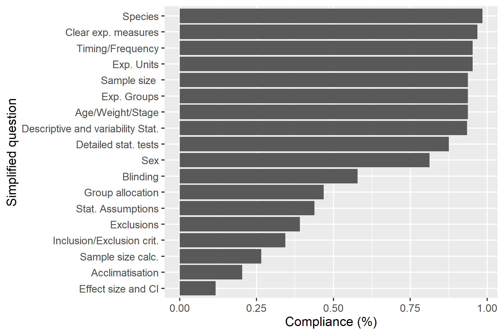

# Abstract

The ARRIVE (Animal Research: Reporting of In Vivo Experiments) guidelines are reporting guidelines designed to improve transparency and facilitate critical assessment of experiments involving animal research. Although it represents essential reporting information for animal experiments, compliance with ARRIVE items is not commonly demanded by journals and is often lacking in animal studies. In this small pilot project, we evaluated compliance with ARRIVE 2.0 essential 10 items in 64 papers from 2018 and 2020, either citing or not the ARRIVE manuscripts. Papers that cited the ARRIVE guidelines had slightly higher reporting scores, but we did not detect an effect of the time period nor an interaction effect between ARRIVE versions 1.0 and 2.0. This work was conducted during the No-Budget Science Hack Week 2021 event, an extended hackathon to discuss and develop projects in metascience. In future work, this pilot can be expanded to better estimate the effects of the ARRIVE guidelines on reporting practices.

# Background

Reporting guidelines gather instructions for authors to improve transparency while writing academic articles in a structured manner, attempting to ensure that all relevant details are comprehensively described. Improvement of reporting quality facilitates the replication of experiments and critical and accurate assessment of the scientific literature [@jin2018does]. Examples of reporting guidelines for different areas of biomedical research can be found at the EQUATOR Network platform (Enhancing the QUAlity, Transparency Of health Research, www.equator-network.org) [@altman2008equator].

The Animals in Research: Reporting In Vivo Experiments (ARRIVE) guidelines were designed by the National Center for the Replacement, Refinement & Reduction of Animals in Research (NC3Rs) originally as a 20-item checklist to improve scientific reporting in animal research  [@kilkenny2010improving]. These guidelines have since been updated to ARRIVE 2.0 (published in 2020) [@percie2020arrive], which improved clarity and included an essential 10 item checklist (E10) to be prioritized. The E10 items represent minimum basic information required to interpret any study including animal experiments. These are related to study design, sample size, inclusion and exclusion criteria, randomization, blinding, outcome measures, statistical methods, experimental animals and procedures, and result descriptions.

Despite the usefulness of reporting guidelines to enhance reporting quality, it is still not commonplace for academic publishers to require their use. Even when journals encourage authors to follow specific guidelines, usually no reviewer or editor is assigned to verify the checklist compliance [@jin2018does, @mcgrath2015implementing]. This means that although authors may be aware of and cite guideline recommendations, these may not be reflected in their reporting practices.

In this small pilot study, we evaluate compliance with questions included in the ARRIVE 2.0 E10 items in papers from 2018 and 2020. We compared articles that either cited or not the ARRIVE guidelines at both time periods. In particular, we were interested in determining whether there was a difference in reporting quality between studies that cited ARRIVE 1.0 and 2.0 versions, controlling for the time period. This project was developed during the No-Budget Science (NBS) Hack Week 2021, a Hackathon-like event to discuss and develop projects in metascience.

# Methods

## Groups for comparison and Article Selection

We used the Dimensions platform (https://app.dimensions.ai) [@hook2018dimensions] to obtain metadata for papers citing either version of the ARRIVE guidelines comprising the period of one year each. In total 521 publications cited ARRIVE 1.0 guidelines [@kilkenny2010improving] in 2018 and 421 publications cited ARRIVE 2.0 [@percie2020arrive] from July 2020 to June 2021. We decided not to sample papers from 2019 because the preprint version of updated ARRIVE guidelines was made available in July 2019 on Biorxiv [@percie2019arrive], and this could in principle impact reporting practices before the final ARRIVE 2.0 version was published.

A small sample size of 16 papers per group was chosen, considering the time available for data collection during the NBS Hack Week event. These papers were randomly selected from the Dimensions list obtained for each ARRIVE group and checked for exclusion criteria. When a publication met exclusion criteria during sampling (n=8), the next randomized one was selected until 16 papers were included.

# Exclusion Criteria
i. Full text not accessible by the group.
ii. Does not include experiment with animals (case reports, observational studies, meta-analysis, review articles, guidelines).
iii. Language other than english.
iv. Citing both versions of the ARRIVE guidelines.

We then searched for corresponding controls in Pubmed that did not cite ARRIVE guidelines. These were matched based on the year of publication and subject of study, determined by the best match of article keywords. After completing sample collection, we evaluated the representation of journals and period of publication among samples. As our sample did not include any papers from 2021, we hereby refer to the ARRIVE 2.0 time period as ARRIVE 2020. This study design included 4 groups with 2x2 factors of time periods and ARRIVE citation status (table 1).

Table 1. Groups of papers compared in this study. This design contains 2x2 factors, the publication time period (2018 / 2020) and ARRIVE citation status (0/1). We only included studies from 2020 published from July 2020, after ARRIVE 2.0 was published.

Publication date | Description | Group |
---------- | ---------- | ---------- |
2018 | citing ARRIVE 1.0 | ARRIVE 2018 |
2018 | not citing ARRIVE 1.0 | nARRIVE 2018 |
From July 2020 | citing ARRIVE 2.0 | ARRIVE 2020 |
From July 2020 | not citing ARRIVE 2.0 | nARRIVE 2020 |

## Data collection

A Google form was designed for data collection based on the ARRIVE 2.0 essential 10 compliance questionnaire formulated by the NC3Rs (National Center for the Replacement, Refinement & Reduction of Animals in Research). This questionnaire was designed to be as concise and as user friendly as possible, and broke down the essential 10 list into 18 sub-items. These are detailed in Table 2. Compliance is considered met if a sub-item is described for at least one experiment. 

To facilitate compliance assessment, a list of keywords was used when searching for ARRIVE sub-items  (Table 2). Keyword hits were evaluated in their context to assess if information was reported for at least one experiment. When no hits were found, the whole manuscript was read to guarantee the item was not covered elsewhere in the paper.

Data collection was performed by members of the NBS Hack Week group and was balanced across comparison groups. Doubts and ambiguities during the pilot data collection were solved by internal discussions until the group reached a consensus and updated the data collection manual.

Table 2. List of ARRIVE items, question abbreviations, usual locations where this information is found in papers and search keywords.

### Study Design
|Question abbreviation | Full Question | Usual locations and Keywords |
|---------- | ---------- | ---------- |
Exp. Groups | Are all experimental 	| Graphs, methods, and  results.|
||and control groups |*“control”, “sample”*|
||clearly identified?| |
|Exp. Units	| Is the experimental unit | Graphs, methods, and results. |
||clearly identified? | *“unit”, “experimental”, “animal”,*|
||| *“cage”, “litter”, “mice”, “rat”.*|

### Sample Size
|Question abbreviation | Full Question | Usual locations and Keywords |
|---------- | ---------- | ---------- |
|Sample size	| Is the exact number of |Graphs, methods, and results. | 
|| experimental units in each  | Visually displaying points or |
|| group provided (e.g. in |reporting a range does not account|
||the format ‘n=’)?| for exact N description.|
||| *“n =”, “n=”, “sample size”* |
|Sample size calc. | Is the method by which  |  Statistics methods section.  |
|| the sample size was |*“sample size”, “number of”, “animals”, *|
||chosen mentioned?|*“rats”, “power”, “calculation”, “determined”*|

### Inclusion & Exclusion Criteria
|Question abbreviation | Full Question | Usual locations and Keywords |
|---------- | ---------- | ---------- |
|Inclusion/Exclusion | Are the criteria used | Graphs, methods, and results. |
|crit.|for including and excluding | *“criteria”, “inclusion”,*|
|| animals, experimental units, or |*“included”,“exclusion”,“excluded”,*|
||data points provided?|*“removed”, “eliminated”, “outlier”*|
|Exclusions	| Are any exclusions of animals, | Graphs, methods, and results. |
|| experimental units, or data 	| *“exclusion”, “excluded”, “removed”,*|
||points reported, or is there| *“eliminated”, “outlier”*|
|| a statement indicating that||
|| there were no exclusions?||

### Group Allocation, blinding, outcome measures
|Question abbreviation | Full Question | Usual locations and Keywords |
|---------- | ---------- | ---------- |
|Group allocation	| Is the method by which  | Method descriptions. | 
|| experimental units were allocated  |*“groups”, “allocation”, “allocated”,*|
||to control and treatment |*“distributed”, “randomisation”,*|
||groups described?|*“randomized”, “randomly”, "among”*|
|Blinding	|Is it clear whether researchers   | Method descriptions. |
||were aware of, or blinded to, |*“aware”, “experimenter”, “researcher”,* |
||the group allocation at |*“masked”, “blind”, “randomisation”,*|
||any stage of the experiment |*“randomized”, “randomly”*|
||or data analysis?||
|Clear exp. measures	| For all experimental  | Graph legends and results.|
||outcomes presented, are  | Unspecified descriptions such as “ratio”  |
|| details provided of exactly   |require further explanation |
||what parameter was measured?|of measured parameters. *N/A*|

### Statistical Methods
|Question abbreviation | Full Question | Usual locations and Keywords |
|---------- | ---------- | ---------- |
|Detailed stat. tests	| Is the statistical approach	| Figure legends and | 
|| used to analyse each | statistics methods subsection.|
||outcome detailed?|*“test”, “statistical”, “significance”, "value"*|
|Stat. Assumptions	| Is there a description  | Figure legends and |
|| of any methods used to  | statistics subsection. |
||assess whether data met | *“data”, “normality”, “assumption”, |
||statistical assumptions?|*“normality”, “homoscedasticity”, “Levene”*|
|||*“heterogeneity”, “sphericity”, “variance”*|

### Experimental Animals
|Question abbreviation | Full Question | Usual locations and Keywords |
|---------- | ---------- | ---------- |
|Species	| Are all species and strains | Animals subsection. Not |
||of animal used specified?|necessary to provide the scientific name.|
|||*“mice”, “mouse”, “rat”, “Mus musculus”,*|
||| *“Rattus norvegicus”, “strain”, “animal”*|
|Sex	| Is the sex of | Animal methods subsection.  | 
||the animals specified? |*“female”, “male”, “sex”*|
|Age/Weight/Stage	| Is at least one of age, | Animals subsection.|
||weight or developmental stage | Can be stated exactly or |
|| of the animals specified?| as a range. *“week”, “old”, *|
|||*“young”, “adult”, “age”, “weight”* |

### Experimental Procedures
|Question abbreviation | Full Question | Usual locations and Keywords |
|---------- | ---------- | ---------- |
|Timing/Frequency	| Are both the timing and | Graphs, methods and results.|
||frequency with which procedures |*“hours”, “weeks”, “post”, “period”,*  |
||took place specified? |*“after”, “procedure”, “submitted”*|
|Acclimatisation	| Are details of acclimatisation | Methods description.| 
||periods to experimental  | *“acclimate”, “housing”,*|
||locations provided?| *“transport”, “moved”*|

### Results
|Question abbreviation | Full Question | Usual locations and Keywords |
|---------- | ---------- | ---------- |
|Descriptive and 	| Are descriptive statistics for  | Graphs and results. |
|variability Stat.|each experimental group provided,|Search for error bars|
||with a measure of variability?|in figures or descriptions|
||| in tables. *N/A*|
|Effect size and CI | Is the effect size and  | Graphs, results and |
||confidence interval provided?|supplementary materials. |
|||*“values”, “detailed statistics”, "95%”,*|
|||*“CI”,“effect size”, “cohen”,* |
|||*“cliff”, “eta”, “n2”*|

## Data analysis
The compliance score for each publication was calculated as the number of positive answers divided by the number of applicable questions (not N/A out of the total 18). We performed a 2-way analysis of variance (ANOVA) to measure the primary outcomes using the  ARRIVE citation status (0/1) and time period (2018/2020) as factors. Given our study design, the interaction term between citing ARRIVE guidelines and time can be interpreted as the effect between different ARRIVE versions. We also compared compliance for each of the 18 sub-items in the total sample or among the ARRIVE citation and time period groups. The differences in numbers of papers complying with each question were compared with one sample t-tests against the null hypothesis of 0. All statistical analysis presented in this paper are descriptive and exploratory.

# Results

The distribution of journals included in our sample and the frequency within each group is represented in figure 1. Notably, there was a small overlap among journals included in each group, even when considering the small sample size (n=16). There was also an enrichment for Scientific Reports and the British Journal of Pharmacology in the ARRIVE 2.0 group, as these journals started requiring mandatory statements of ARRIVE compliance during the submission process. 

Compliance scores for papers included in this study are presented in figure 2. Interestingly, we did not observe large differences in ARRIVE compliance between groups, as reflected in 2-way ANOVA results. Overall, papers that cited ARRIVE had slightly higher compliance scores (Figure 2B) (F = 7.122, p = 0.0098), but we did not observe differences between the time periods (Figure 2C) (F = 0.994, p = 0.32). We also did not detect an interaction effect between citing ARRIVE guidelines and time (F = 0.030, p =  0.86), which in our study design corresponds to the difference between ARRIVE 1.0 and 2.0 versions.

To investigate which sub-items were most frequently answered, we also analyzed compliance scores at the level of individual questions (Figure 3). Papers often include descriptions that are important to understand experimental procedures such as information on biological models, experimental measures and timing and frequency of procedures. Sub-items that had the lower compliance scores were related to study design, such as sample size calculation, statistical assumptions, inclusion and exclusion criteria and allocation of animals to experimental groups. The items with the lowest scores were explicit reporting of effect sizes and confidence intervals and details on acclimatization, as these are not commonly reported in biomedical papers.

We also investigated if there were changes in specific E10 sub-item reporting over time or with ARRIVE citations (Figure 4). We calculated the difference between the number of papers that complied with each sub-item between groups citing any version of ARRIVE guidelines (1 x 0) and between time periods (2020 x 2018), and performed one sample t-tests against a mean null hypothesis of 0. The mean increase in number of papers complying with sub-items was 3.22, 95% CI [1.72, 4.72], p = 0.0003 for groups citing ARRIVE (Figure 4A). Sub-items with the largest difference in number of papers were details on inclusion and exclusion criteria, acclimatization, blinding and sample exclusions for ARRIVE groups. When comparing 2020 and 2018, the mean increase in number of papers complying with sub-items was 1.55, 95% CI [0.51, 2.59], p = 0.006 (Figure 4B). The largest differences were found in items describing statistical assumptions, sample exclusions, inclusion and exclusion criteria and group allocation. These results reveal a modest increase in the number of papers with compliance between groups, at the level of individual sub-items.

# Discussion

In this work, we describe ARRIVE compliance in a small sample of papers from 2018 and 2020, either citing or not the different ARRIVE guideline versions. This pilot study was conducted during the No-Budget science Hack Week 2021 event, an extended hackathon to develop projects in metascience. Our sample size was limited due to the time available for data collection, but this could be expanded in future work to better describe the impact of ARRIVE citations and versions in reporting practices.

Publication venues could be important confounders with ARRIVE compliance, as authors are generally aware of reporting practices within journals they submit manuscripts to. Of note, some journals were particularly enriched in the ARRIVE 2.0 sample, such as the British Journal of Pharmacology (BJP) and Scientific Reports (Figure 1). Both of these journals started adopting mandatory compliance to ARRIVE guidelines for article submission [@lilley2020arrive], which explains its overrepresentation in the ARRIVE 2.0 citing group.  When matching controls that did not cite ARRIVE guidelines, we prioritized having a similar research topic based on keywords use, but not other paper characteristics such as citation counts, venue of publication or impact factors. This resulted in mostly distinct sets of journals included for each group and is a limitation for interpreting results. In future work, this could probably be mitigated simply by increasing the sample size or by pairing articles from the same set of  journals. 

We found that papers citing ARRIVE, regardless of its version, had higher compliance scores, as measured by the proportion of positively answered items out of valid questions. (Figure 2). In our sample, all papers citing any version of ARRIVE guidelines complied with at least half of the valid E10 sub-items. However, only two papers achieved the highest score, meaning that even when the guideline is cited, the checklist is not completely fulfilled. Similar findings were observed in the IICARus trial, where authors from 845 manuscripts were asked to fill a compliance form but none fully complied with the ARRIVE checklists [@hair2019randomised]. Also, for our study, the compliance criteria was attended when at least one experiment described the corresponding feature, and, although analyzing individual experiments within papers was beyond the scope of this study, the group observed that frequently the criteria was not met for all experiments.

When analyzing individual questions (Figure 3), it was evident that important characteristics of study design are often not reported, including sample size calculation, statistical assumptions, inclusion and exclusion criteria and allocation of animals to experimental groups. Papers frequently describe details of biological models and experimental procedures, but not the source of animals and the conditions for acclimatization. Reporting explicit effect sizes and confidence intervals was the item with the lowest compliance, which reflects a lack of attention to effect size estimation precision in biomedical practice. Results are often described qualitatively in text, and claims are supported to a large extent by statistical significance. Overall, these results are similar to previous reports of ARRIVE compliance  [@kilkenny2009survey, @baker2014two]. Reporting of timing and frequency of experimental procedures and description of biological models was substantially higher than manuscripts from the IICarus trial  [@hair2019randomised]. This might be due to its more detailed checklist and stricter criteria, which covered all items in the ARRIVE 1.0 guidelines and operationalized it into 108 specific questions.

Importantly, though we did not detect an effect of the time period between 2018 and 2020 papers, this is a rather short time interval, and larger differences can be observed relative to older papers. Although far from ideal, reporting of group allocation and blinding in our sample was higher than for PLOS ONE papers from 2015 [@hair2019randomised], Nature and PLOS papers from 2008 to 2012 [@baker2014two] and USA and UK studies from 1999 to 2005 [@kilkenny2009survey], indicating some improvement over the years.

Previous studies have suggested that endorsement of reporting guidelines by journals is a factor that increases adherence from authors [@jin2018does], but simply requiring statements of ARRIVE compliance without checking the quality of descriptions does not seem to be enough  [@hair2019randomised]. Even though many journals and funders have endorsed the use of ARRIVE guidelines, generally peer reviewers and editors have no designated role on their enforcement, limiting their impact [@baker2014two, @hair2019randomised, @mcgrath2015implementing]. 

Additionally, insufficient adherence to reporting guidelines in biomedical sciences probably reflects a lack of planning during experimental research. We expect that authors that go through careful considerations when designing their studies are much more likely to report their choices and procedures, such that low compliance is likely a symptom of flexible and exploratory research practices. Strictly enforcing that authors report ARRIVE sub-items in manuscripts might actually improve scientific practices in the long term, by drawing attention to important aspects of study design that are often overlooked in basic biological research.

Publications in peer-reviewed scientific journals are the main source of information used by the scientific community to generate novel hypotheses and compare existing findings, advancing the frontiers of knowledge. To this end, it is critical that essential information for the interpretation of results and procedures are properly described. As shown in various reports, however, this is still considerably lacking in experimental animal studies. Reporting guidelines can guide authors to accomplish this task, but we believe it is necessary to enforce compliance as part of the editorial process, instead of simply endorsing and recommending their use. Though increased awareness of ARRIVE guidelines and improvements in reporting quality have been observed over the years, studies in biomedical sciences still require a substantial increase in adherence with these recommendations to obtain a more transparent and reproducible animal research.
 

# Future Work
This pilot study indicated an increase in ARRIVE E10 compliance scores between papers citing and not citing ARRIVE, but not an effect of the time period or ARRIVE versions. When comparing each individual sub-item we observed an increase in reporting of specific points among groups, mainly inclusion and exclusion criteria, acclimatization, blinding and sample exclusions. Specific effects on ARRIVE compliance can be better estimated by analyzing larger samples of papers, potentially crowdsourcing efforts and expanding the project beyond the NBS Hack Week 2021 event.

# GitHub repositories and data availability

All deliverable material resulting from the Hack Week, raw data and scripts for data analysis can be found at OSF https://osf.io/nu57w/. Figures, paper.md and paper.bib files used to generate this manuscript are available at https://github.com/jufernandy/ARRIVE-compliance.

# Acknowledgements

We thank professor Dr. Olavo Amaral and the No-Budget Science Hack Week 2021 event organization (https://www.reprodutibilidade.bio.br/hack-week-2021). We thank Tiago Lubiana for his workshop on Markdown that helped us write this preprint and submit it to BioHackrXiv. We also acknowledge Dr Nathalie Percie du Sert and Dr Matthew Brooke from the National Centre for the Replacement, Refinement and Reduction of Animals in Research (NC3Rs) for their kind assistance and suggestions and for answering questions about the ARRIVE questionnaire. We thank Instituto Serrapilheira for sponsoring this event.

# References
